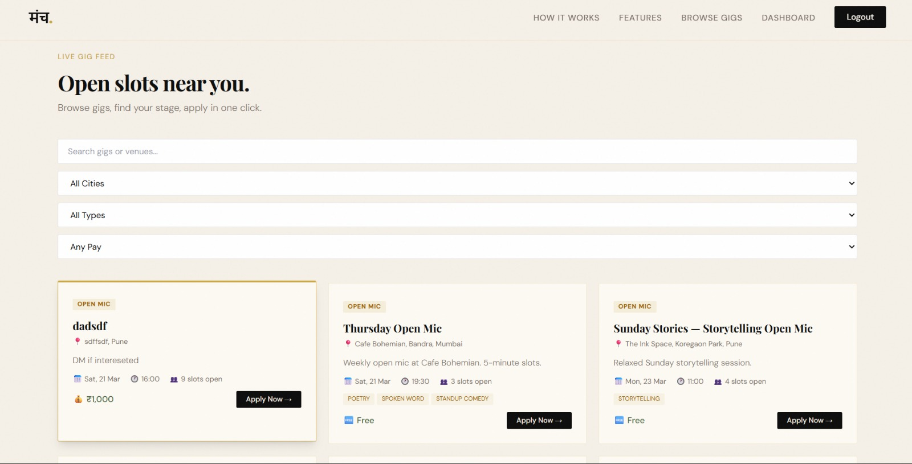
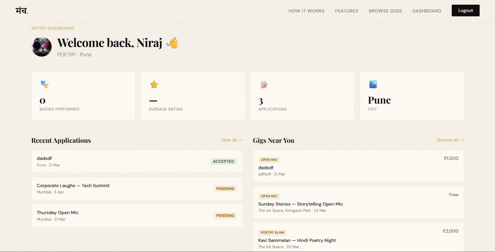
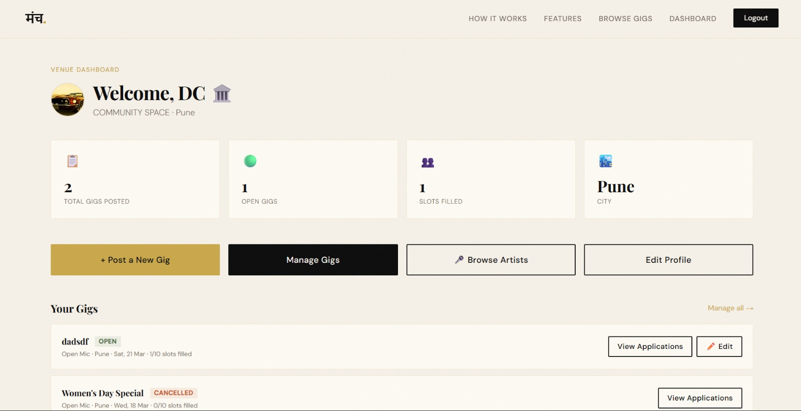
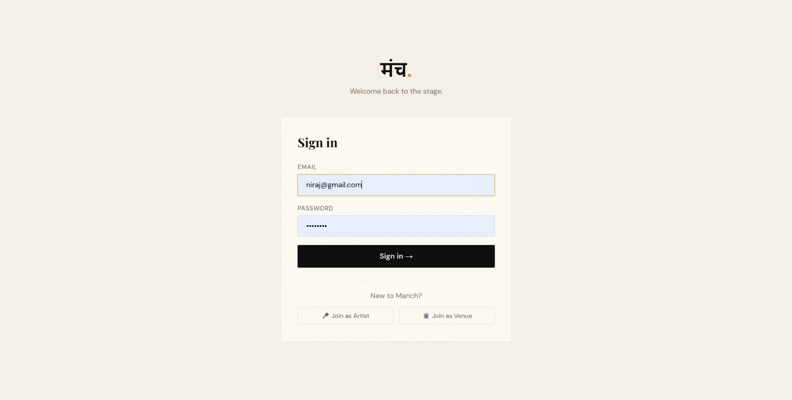

# 🎤 Manch — Every Artist Deserves a Stage

Full-stack platform connecting performing artists with open mics, cafes, colleges and events across India. Artists browse and apply to gigs. Venues post opportunities and manage applications — all through a JWT-secured, role-based REST API.

## Screenshots

### Landing Page


### Browse Gigs


### Artist Dashboard


### Venue Dashboard


### Login


## Tech Stack
| Layer | Technology |
|-------|-----------|
| Frontend | React 18, TypeScript, Vite, Tailwind CSS, Redux Toolkit, TanStack React Query |
| Backend | Java 17, Spring Boot 3, Spring Security, Spring Data JPA |
| Database | MySQL 8.2 (prod) · H2 in-memory (local, zero setup) |
| Auth | JWT + Refresh Tokens, Role-based Access Control |
| Migrations | Flyway |
| Container | Docker + Docker Compose |
| Testing | JUnit 5, Mockito |

## Features
- **Artist flow** — register → build profile → browse gigs → apply → track applications
- **Venue flow** — register → post gigs → manage applications → accept/reject artists
- **JWT Auth** — access + refresh tokens, role-based route guards (ARTIST, VENUE, ADMIN)
- **REST API** — 7 controllers, paginated endpoints, filter by city/type/pay
- **Dashboards** — role-based with live stats and application tracking
- **Unit tested** — JUnit 5 + Mockito tests for GigService and AuthService
- **Containerised** — Docker Compose orchestrates backend, frontend, and MySQL

## Quick Start (Zero Setup)
```bash
# 1. Backend — uses H2 in-memory, no MySQL needed
cd backend
./mvnw spring-boot:run -Dspring-boot.run.profiles=local

# 2. Frontend (new terminal)
cd frontend
npm install && npm run dev
```
- App: http://localhost:5173
- API: http://localhost:8080
- Swagger: http://localhost:8080/swagger-ui.html
- H2 Console: http://localhost:8080/h2-console

## With MySQL
```bash
cp .env.example .env  # fill MYSQL_* vars
cd backend
./mvnw spring-boot:run -Dspring-boot.run.profiles=dev
```

## Docker (Full Stack)
```bash
cp .env.example .env
docker-compose up --build
```

## Test Accounts
| Email | Password | Role |
|-------|----------|------|
| priya@example.com | Test@1234 | ARTIST |
| arjun@example.com | Test@1234 | ARTIST |
| cafe@bohemian.in | Test@1234 | VENUE |
| iitb@fest.in | Test@1234 | VENUE |
| admin@manch.in | Admin@1234 | ADMIN |